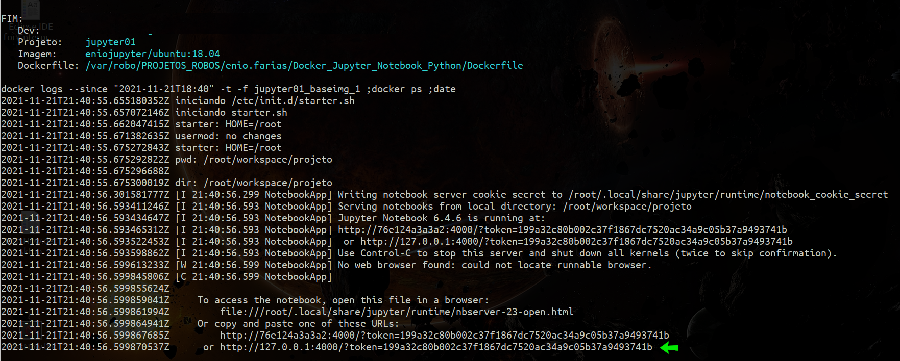

# docker pronto com Jupyter Notebook 

## iniciando:

  - faça o download desse repositorio
  - entre na pasta do projeto e execute o comando:
    - ./start_docker.sh

  - aguarde a conclusão de todo o processo que será:
    - 1º vai baixar o ubuntu:18.04
    - 2º vai criar uma imagem personalizada 
    - 3º vai verificar e iniciar o conteiner
  

  - obs:
    - ao usar o **"./start_docker.sh"** irá ser feito os seguintes testes:
    - se não houver a imagem personalizada, ele vai criar
    - se já existir um conteiner em execução, irá matar, e depois irá iniciar novamente
  

  - após tudo iniciar corretamente, o terminar irá mostrar a seguinte a saída com a url e token do Jupyter
  - a saída do Jupyter também é salva no arquivo **"./Temp/url_jupyter.txt"**
    
